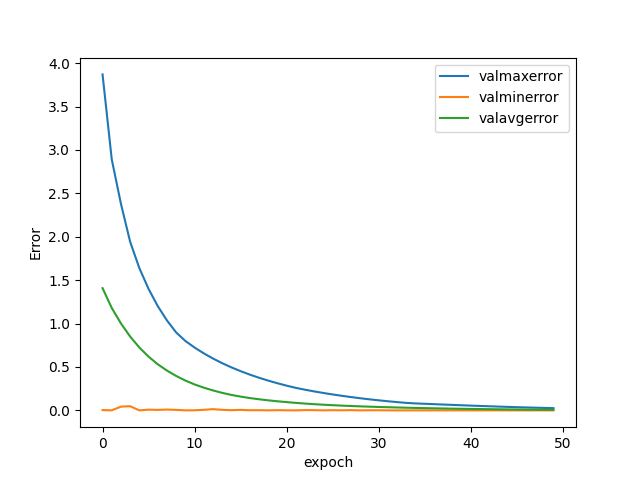

# Linear-Regression
## It is a project on visualizing linear regression. 
The class take input from csv and generate result on matplotlib.
This project is aim at using multiple linear regression in observing relationship of data from excel.

## The format of csv file
1.  Save excel as csv dos (Not CSV UTF-8)
2.  The last row will be the output
3.  Only support numeric data type
## Demo
There is a demo in <a href="https://github.com/waito3209/Linear-Regression/blob/master/main.py">main.py</a>. The demo use the data from seed.xlsx.  
          seed --> traindata.csv  
&nbsp;&nbsp;&nbsp;&nbsp;&nbsp;&nbsp;&nbsp;&nbsp;&nbsp;&nbsp;&nbsp;&nbsp; --> testdata.csv  
It will observe the length output from csv in auto. 
## Meaning of function
### Class LinearRegression
| function        | input           |    |
| ------------- |:-------------:| -----:|
|init |||
|self, data: list, path: str = None, constant: float = float(1),errorpercent:bool=True) |  |  |
|  constant: float = float(1),errorpercent:bool=True)    | data    |    train data list  |
|                                                        | path    |   path to save variable output in  .npy|
|                                                         |constant|initof constant|
|                                                         |errorpercent|calculate error oin percent|
|||
|||
|trainsimpleLR||
|(self, epoch: int = 1, learning_rate: float = 1, learning_decay:bool = True ,|||
|learning_decay_rate:float = 0.7,|epoch|Number of epoch|
|printable: bool = True, testdata: list = None,|learning_rate|learning rate in training|
|selftest: bool = True,showdot=1):|learning_decay| apply learning rate decay|
||learning_decay_rate|if use learning rate decay the learning will be calculated by a=(1/(1+epochs*learning_decay_rate))*learning_rate|
||printable|print detail or not|
||selftest|do self test or not|
||showdot|showdot | 0 to not show dot for epoch else show x dot int each line|
|    save()||save the trained variable|
  | report()||print the report|
